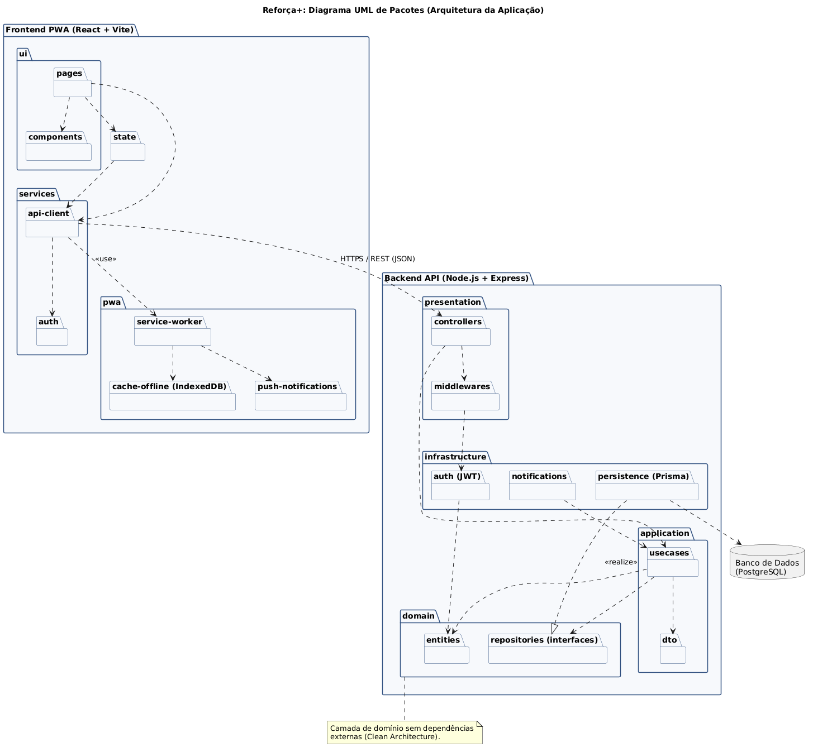
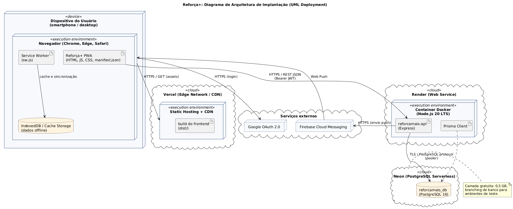
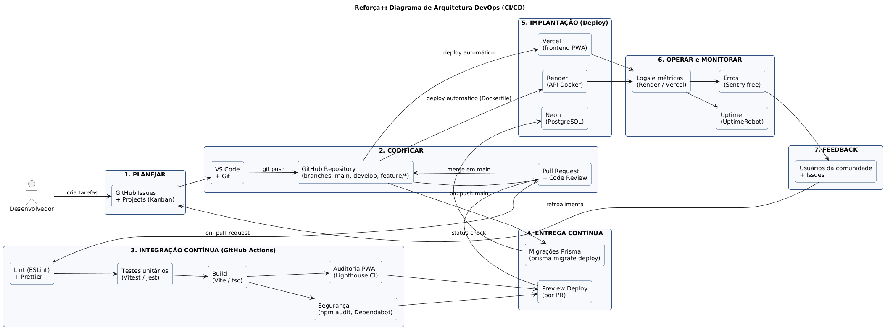

# Reforça+: Reforço Escolar Comunitário (PWA)

**Prática Extensionista IV - Avaliação 1: Modelagem de Sistema de Informação (PWA)**

## Integrantes
- Vinicios Andrei Mensen, RA 445509

## Problema social / domínio
Alunos da rede pública em situação de vulnerabilidade têm dificuldade de acesso a reforço escolar, enquanto voluntários (universitários, professores aposentados) não têm um canal organizado para oferecer ajuda. O **Reforça+** é um PWA que conecta tutores voluntários a alunos e famílias, permitindo:

- Cadastro de alunos, responsáveis e tutores voluntários;
- Agendamento de aulas de reforço (presencial em espaços comunitários ou on-line);
- Disponibilização de materiais de estudo com acesso **offline** (service worker + cache);
- Acompanhamento de frequência e progresso por disciplina;
- Notificações push (lembrete de aula, novo material).

Por ser PWA, funciona em qualquer smartphone (Android/iOS) sem loja de aplicativos, é instalável na tela inicial e resiliente a conexões instáveis - cenário comum na comunidade atendida.

## Stack tecnológica
| Camada | Tecnologia |
|---|---|
| Frontend PWA | React 18 + Vite + Workbox (service worker), IndexedDB |
| Backend API | Node.js 20 + Express + Prisma ORM (REST/JSON, JWT) |
| Banco de dados | PostgreSQL 16 |
| CI/CD | GitHub Actions |
| Hospedagem | Vercel (frontend), Render (API), Neon (PostgreSQL) |

## Diagramas
Fontes em PlantUML em `docs/diagramas/` e imagens renderizadas em `docs/imagens/`.

| Diagrama | Fonte | Imagem |
|---|---|---|
| UML de Pacotes (arquitetura da aplicação) | [01-diagrama-pacotes.puml](docs/diagramas/01-diagrama-pacotes.puml) |  |
| Arquitetura de Implantação (UML Deployment) | [02-diagrama-implantacao.puml](docs/diagramas/02-diagrama-implantacao.puml) |  |
| Arquitetura DevOps (CI/CD) | [03-diagrama-devops.puml](docs/diagramas/03-diagrama-devops.puml) |  |

Para regerar as imagens: `java -jar plantuml.jar -tpng -o ../imagens docs/diagramas/*.puml`

## Infraestrutura de deploy
A escolha e justificativa completa está em [docs/infraestrutura.md](docs/infraestrutura.md).

## Estrutura do repositório
```
.
├── README.md
├── docs/
│   ├── diagramas/        # fontes .puml
│   ├── imagens/          # .png / .svg renderizados
│   └── infraestrutura.md # descrição e justificativa da infra
├── .github/workflows/ci.yml
├── frontend/             # (a desenvolver) PWA React
└── backend/              # (a desenvolver) API Node.js
```
